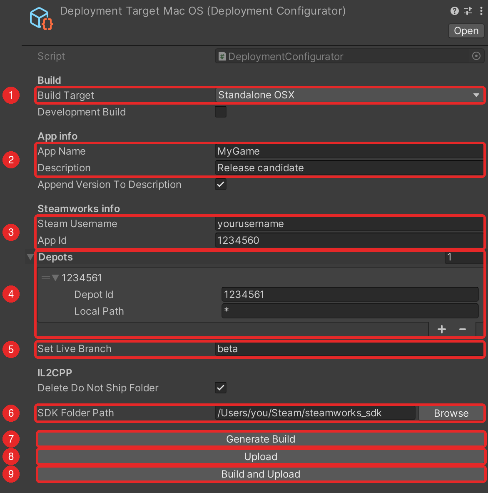
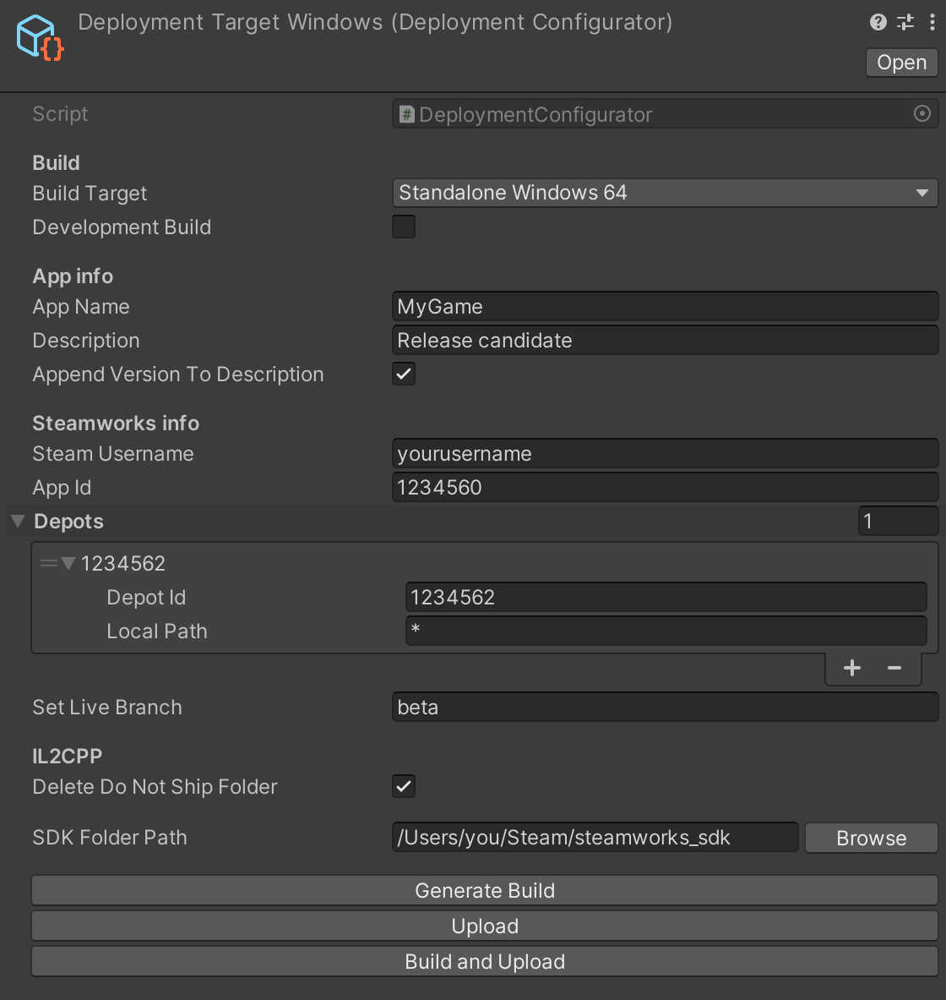

# SteamPipeGUI for MacOS (Unity)

Simplify the process of bringing your game to Steam for macOS with our user-friendly deployer tool. This tool streamlines the upload process using the Steamworks SDK, ensuring a seamless experience for macOS users while maintaining consistency across different platforms. Easily publish your game on Steam hassle-free!

## Table of Contents
- [Overview](#overview)
- [Requirements](#requirements)
- [Getting Started with Steamworks](#getting-started-with-steamworks)
- [Download Steam SDK](#download-steam-sdk)
- [Configuring Launch Options](#configuring-launch-options)
- [Installing Depots](#installing-depots)
- [Installing Deployer in Unity](#installing-deployer-in-unity)
- [Deploying Builds from Unity Editor](#deploying-builds-from-unity-editor)
- [Headless Use and the Claude Code Skill](#headless-use-and-the-claude-code-skill)
- [How It Works](#how-it-works)
- [Troubleshooting](#troubleshooting)
- [Upgrading from 1.1](#upgrading-from-11)
- [Running the Tests](#running-the-tests)
- [License](#license)

## Overview

While Windows users have the luxury of SteamPipeGUI for deploying builds effortlessly, macOS users face the challenge of using Steam commands in their Command Line Interface (CLI). Steam's documentation can be unclear for first-timers. To address this, I created this repository, providing a tool to publish new builds on Steam directly from your Unity Editor on macOS. The best part? It reduces the publishing time from 30 minutes to under 1 minute.

## Requirements

- macOS. The upload runs `steamcmd.sh` from the SDK's `builder_osx` folder, so the Unity Editor must be running on a Mac. The build itself can target macOS, Windows or Linux.
- Unity 2018.3 or newer with the .NET 4.x scripting runtime. Tested on Unity 2022.3.
- The [Steamworks SDK](#download-steam-sdk) unpacked somewhere on disk.
- A Steamworks account with an App ID and at least one Depot ID (see the sections below).

## Getting Started with Steamworks

Follow these steps to set up your game on Steam:

1. **Create a Steamworks Account:**
   Visit the Steamworks website and follow the registration process to set up your developer account.

2. **Access the Steamworks Dashboard:**
   Log in and navigate to the Steamworks dashboard.

3. **Create Your Application:**
   Initiate the process of creating a new application for your game within the Steamworks dashboard.

4. **Obtain Your App ID:**
   Steam will assign a unique App ID to your game during the application creation process.

## Download Steam SDK

The Steamworks SDK provides a range of features which are designed to help ship your application or game on Steam in an efficient manner.

You can download the latest version of the Steamworks SDK [here.](https://partner.steamgames.com/?goto=%2Fdownloads%2Flist)

Inside Steam SDK is where your builds are located. Also, there are some .vdf scripts located inside the SDK folder, and they are tricky to set up. But do not worry, because this tool will handle all of it for you. You only need to provide an APP ID and DEPOT ID, which you can learn about in further steps.

## Configuring Launch Options

To configure launch options:

1. Go to Steamworks Dashboard.
2. Click on Dashboard and select your app.
3. Go to **Edit Steamworks Settings** > Installation > General Installation.
4. Add your Launch Options for each platform.

   Example:
   

## Installing Depots

Depots organize game content into categories. Follow these steps to create depots for each platform:

1. Go to the [Steamworks dashboard](https://partner.steamgames.com/).
2. Select your app and navigate to the "Edit Steamworks Settings" section.
3. In the left menu, choose "SteamPipe" and then select "Depots."
4. Click on "Add new Depot" to create a new depot.

    

5. Fill in the necessary details for your depot, such as the name and description.
6. Configure the content for the depot, specifying the files and folders associated with this particular depot.
7. Save your changes.

Repeat these steps for each platform you intend to support. Depots allow you to organize and manage different aspects of your game content efficiently on the Steam platform.

## Installing Deployer in Unity

1. Open your Unity project.
2. Open Package Manager (**Window > Package Manager**).
3. Click on **+** and choose **Add package from Git URL**.
4. Paste the URL below and click **Add**.

   ```
   https://github.com/tomicz/steam-pipe-gui-macos-unity.git
   ```

To stay on a specific release, append the tag to the URL, for example `https://github.com/tomicz/steam-pipe-gui-macos-unity.git#v1.3.0`. Releases are listed in [CHANGELOG.md](CHANGELOG.md).

## Deploying Builds from Unity Editor

Right-click inside your Unity Project tab and go to **Create > Tomicz > Steam > Deployment Target**. Create one target per platform, e.g. `DeploymentTargetMacOS`, `DeploymentTargetWindows`, then fill it in. The numbers below match the screenshot.



1. **Build Target**: `StandaloneOSX`, `StandaloneWindows`, `StandaloneWindows64` or `StandaloneLinux64`. Other platforms are rejected. Tick **Development Build** for a build with the profiler connection and development console.
2. **App Name** and **Description**. The app name is the executable name and must match your Launch Options. The description shows up in the Steamworks build list. Tick **Append Version To Description** to add the version from Player Settings, so `Release candidate` becomes `Release candidate 1.2.0`.
3. **Steam Username** and **App ID** from the Steamworks dashboard.
4. **Depots**: one entry per depot that receives this build. Most games need a single entry with **Local Path** `*`. Click **+** to add DLC or shared-content depots and give them a subfolder pattern such as `DLC/*`.
5. **Set Live Branch**: the branch the upload is set live on. Defaults to `beta`. Leave it empty to upload without setting it live and pick the build manually under SteamPipe > Builds.
6. **SDK Folder Path**: click **Browse** and select the root folder of the Steamworks SDK, the one containing `tools/ContentBuilder`. The path is saved with the target. You can also paste it.
7. **Generate Build** builds the scenes enabled in Build Settings into the SDK content folder. A failed build is reported in the Console.
8. **Upload** opens a Terminal window that runs `steamcmd`. Enter your Steam password and Steam Guard code when asked, then wait for the upload to finish.
9. **Build and Upload** runs both steps in order and stops if the build fails.

**Delete Do Not Ship Folder** (IL2CPP only) deletes the `<AppName>_BackUpThisFolder_ButDontShipItWithYourGame` folder when you click **Upload**, so it is never shipped to players. Back it up between Generate Build and Upload if you need it for debugging.

A Windows target looks the same, with the build target switched:



Missing fields, a wrong SDK path or a missing build are reported in the Console before anything runs. After the upload is complete, go to your app in the Steamworks dashboard and click SteamPipe > Builds to see your newly uploaded builds.

## Headless Use and the Claude Code Skill

Everything the buttons do can also run from a terminal through Unity batch mode, with no editor window. Close the project in the Unity Editor first, since batch mode cannot open a project that is already open.

```sh
UNITY=/Applications/Unity/Hub/Editor/2022.3.62f2/Unity.app/Contents/MacOS/Unity

# Create or update a target. Only the arguments you pass are changed.
"$UNITY" -batchmode -nographics -quit -projectPath . -logFile - \
  -executeMethod Tomicz.Deployer.CommandLine.CreateTarget \
  -deploymentTarget Assets/Deployment/MacOS.asset \
  -buildTarget StandaloneOSX -appName MyGame -description "Release candidate" -appendVersion true \
  -steamUsername yourusername -appId 1234560 -depot 1234561 \
  -setLiveBranch beta -sdkPath "/Users/you/Steam/steamworks_sdk"

# Build, then prepare the upload (checks the build, rewrites the VDF scripts, writes the upload script).
"$UNITY" -batchmode -nographics -quit -projectPath . -logFile - \
  -executeMethod Tomicz.Deployer.CommandLine.BuildAndPrepareUpload -deploymentTarget Assets/Deployment/MacOS.asset

# Upload. steamcmd asks for your password and Steam Guard code the first time, then caches the login.
sh "/Users/you/Steam/steamworks_sdk/tools/ContentBuilder/scripts/upload_build_1234560_StandaloneOSX.sh"
```

Entry points: `CreateTarget`, `Build`, `PrepareUpload` and `BuildAndPrepareUpload`, all under `Tomicz.Deployer.CommandLine`. Each reads `-deploymentTarget`, prints its messages with a `[SteamDeployer]` prefix and exits Unity with code 1 on failure. `CreateTarget` accepts `-buildTarget`, `-appName`, `-description`, `-appendVersion`, `-developmentBuild`, `-steamUsername`, `-appId`, `-depot ID` or `-depot ID:LocalPath` (repeatable), `-setLiveBranch`, `-deleteDoNotShipFolder` and `-sdkPath`.

### Claude Code skill

`Skills~/steam-deploy` is a [Claude Code](https://claude.com/claude-code) skill that teaches the AI this whole flow, including the rules that keep it safe: it never handles your Steam password or Steam Guard code, it refuses to run while the project is open in the editor, and it asks before an upload that sets a build live. Install it into your Unity project:

```sh
mkdir -p .claude/skills
cp -R "$(ls -d Library/PackageCache/com.tomicz.unity-steam-macos-deployer@* | head -1)/Skills~/steam-deploy" .claude/skills/
```

Then, in Claude Code inside the project, ask for what you want, for example "build the macOS target and upload it to Steam". The skill's `scripts/unity-batch.sh` finds the right Unity version for the project, keeps the full log under `Logs/`, and prints only the relevant lines.

## How It Works

Everything happens inside the Steamworks SDK folder you selected:

- **Generate Build** writes `tools/ContentBuilder/scripts/app_build_<AppId>_<BuildTarget>.vdf` plus one `depot_build_<DepotId>.vdf` per depot from the target's fields, then builds the player into `tools/ContentBuilder/content/<BuildTarget>/<AppName>.app` (or `.exe`, `.x86_64`).
- **Upload** checks that the executable exists, rewrites the VDF files so they match the current Inspector values, deletes the IL2CPP do-not-ship folder if that option is on, writes `tools/ContentBuilder/scripts/upload_build_<AppId>_<BuildTarget>.sh`, and runs it in Terminal:

  ```
  tools/ContentBuilder/builder_osx/steamcmd.sh +login <username> +run_app_build_http tools/ContentBuilder/scripts/app_build_<AppId>_<BuildTarget>.vdf +quit
  ```

- Each depot script uploads the files matching its Local Path under `content/<BuildTarget>` recursively and excludes `*.pdb` files.

## Troubleshooting

- **"SDK folder path is not set or does not contain tools/ContentBuilder"**: select the SDK root folder, not a subfolder.
- **"steamcmd.sh not found"**: the SDK is incomplete or the path is wrong. The file lives at `tools/ContentBuilder/builder_osx/steamcmd.sh`.
- **"No build found at ..."**: click **Generate Build** first, or check that App Name matches the executable that was built.
- **"Build target ... is not a standalone platform"**: pick one of the four standalone targets.
- **"No scenes are enabled in Build Settings"**: open File > Build Settings and add at least one scene. Only enabled scenes are built.
- **"Depot ID ... is listed more than once"**: each depot may appear once in the Depots list.
- **Login fails in Terminal**: Steam Guard asks for a code on the first login from a machine. Type it in the Terminal window.
- **Build is not showing up in Steamworks**: check the Terminal output for errors, and make sure every Depot ID in the target belongs to the App ID.
- **The SDK path contains a single quote**: rename the folder. Quotes in the path cannot be passed safely to Terminal.
- **Batch mode prints "Scripts have compiler errors"**: the project does not compile. Open it in the editor and fix the errors first.

## Upgrading from 1.1

- The single **Depot ID** field became the **Depots** list. Existing targets are migrated the first time they load, so open each target once and save the project.
- The VDF scripts are now named `app_build_<AppId>_<BuildTarget>.vdf` and `depot_build_<DepotId>.vdf`. The old `app_<DepotId>.vdf` and `depot_<DepotId>.vdf` files in `tools/ContentBuilder/scripts` are no longer used and can be deleted.

## Running the Tests

The VDF generation has EditMode tests in `Tests/Editor`. To run them from a project that installed this package through Package Manager, add the package name to `testables` in `Packages/manifest.json`:

```json
"testables": ["com.tomicz.unity-steam-macos-deployer"]
```

Then open **Window > General > Test Runner** and run the EditMode tests, or from a terminal:

```sh
"$UNITY" -batchmode -nographics -projectPath . -runTests -testPlatform EditMode -testResults results.xml
```

## License

MIT. See [LICENSE](LICENSE).

Developed by Darko Tomic - Tomicz Engineering LLC
